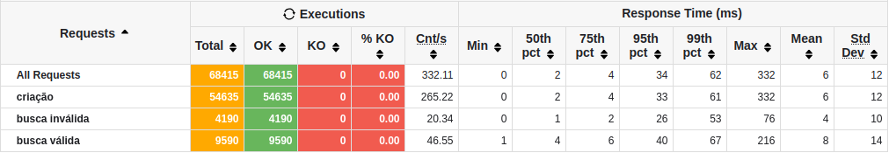

<h1 align="center" style="font-weight: bold;">Performance Rinha Backend 2023 Java/Spring</h1>

<p align="center">
    
    
    
    
    
    
    
</p>

<p>
    Este projeto é uma implementação do desafio do evento da <a href="https://github.com/rinhadebackend/edicao-1">Rinha 
    de Backend 2023 q3</a> que na época me causou muita curiosidade por conta das várias técnicas de performance 
    discutidas pela comunidade, especialmente pelo <a href="https://youtu.be/XqYdhlkRlus?si=elUDklgGduGIYNtI">
    MrPowerGamerBr</a> que fez um vídeo sobre o desafio, por ele que conheci o evento, e pelo 
    <a href="https://youtu.be/EifK2a_5K_U?si=2eyRJRvOs2Twu_o4">Fábio Akita</a> que também fez outros vídeos aprofundando 
    mais ainda sobre várias técnicas de performance. Além das técnicas discutidas por eles, também utilizei outras 
    técnicas e ferramentas que descobri durante o desenvolvimento enquanto investigava os gargalos, algumas delas sendo 
    próprias da minha stack.
</p>
<p>
    A principal motivação para a implementação desse projeto foi pôr em prática todas as técnicas que até então eu não 
    tinha conhecimento e alcançar pelo menos 40k de inserts. O desafio em questão se trata de que a as aplicações devem 
    passar por um teste de carga possuindo limites de CPU e memória. Essa é a minha segunda implementação do desafio 
    onde, de fato, usei as técnicas de performance. Minha <a href="https://github.com/DaviFaustino/rinha-backend-2023-java-spring">
    primeira implementação</a> foi feita apenas para efeito de comparação com a versão performática.
</p>
<p>
    Para o teste de carga, utilizei uma versão do gatling mais recente daquela que foi usada na competição e traduzi o
    código do teste em Scala para Java. No teste de carga, essa implementação conseguiu executar 100% dos inserts com
    sucesso e o tempo de resposta de 99% das requisições foi de 62 milissegundos.
</p>

</img>

## Técnicas de performance

<b>- Abordagem reativa não bloqueante</b>  
<b>- Configurações de memória no PostgreSQL</b>  
<b>- Uso de índice GiST na busca feita na coluna "busca" com as strings concatenadas</b>  
<b>- Queries de baixo nível com DatabaseClient do R2DBC Core ao invés de ORM/JPA</b>  
<b>- Lançamento de exceções sem mensagem</b>  
<b>- Configuração do Garbage Collector e memória da JVM</b>  
<b>- Configuração de workers de conexão e outras configurações do Nginx</b>  
<b>- Uso de network mode "host" nos containers Docker</b>  
<b>- Uso de Cpusets(aqui a mágica acontece) e reservations no Docker compose</b>

## Como executar

### Clonar projeto

Utilize o [Git](https://git-scm.com/) para clonar o projeto e em seguida acesse o seu diretório.

```bash
git clone https://github.com/DaviFaustino/performance-rinha-backend-2023-java-spring.git
```

### Executar

Para executar o projeto, é preciso ter instalado o [Docker](https://docs.docker.com/engine/install/) e o 
[Docker Compose](https://docs.docker.com/compose/install/).  
Execute com o seguinte comando no terminal para rodar a aplicação:

```bash
docker compose up -d
```
